Examples
========

In all the examples on this page, three iterations with 4th order D-scale fits
are used to reproduce the example from [SP06]_, Table 8.2 (p. 325). Each example
recovers the same result, but with a different way to specify the D-scale fit
orders.

This example is quite numerically challenging, so if you encounter a solver
error, you may need to experiment with solver tolerances.

D-K iteration with fixed fit order
----------------------------------

In this example, the number of iterations is fixed to 3 and the order is fixed
to 4.

.. literalinclude:: ../examples/1_example_dk_iter_fixed_order.py
  :language: python

Output::

    mu=1.0368156433105469

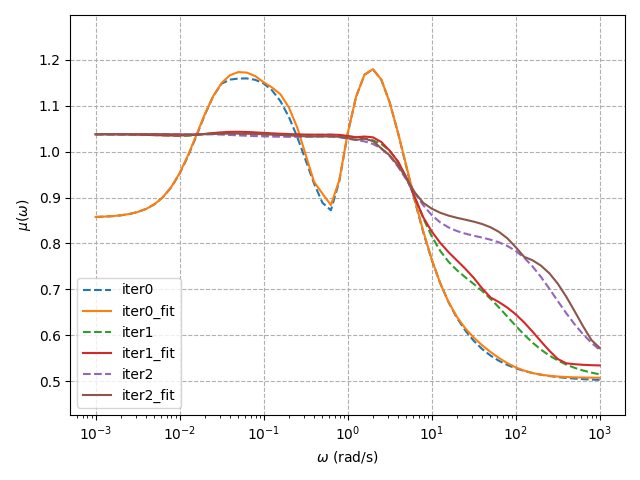

D-K iteration with list of fit orders
-------------------------------------

In this example, the orders are specified in a list. They can be specified
manually for each entry of the D matrix, or they can all be set to the same
integer.

.. literalinclude:: ../examples/2_example_dk_iter_list_order.py
  :language: python

Output::

    mu=1.0368156433105469

D-K iteration with automatically selected fit orders
----------------------------------------------------

In this example, multiple fit orders are attempted up to a maximum, and the one
with the lowest relative error is selected.

.. literalinclude:: ../examples/3_example_dk_iter_auto_order.py
  :language: python

Output::

    INFO:DkIterAutoOrder:Iteration: 0, mu: 1.1792182922363281
    INFO:DkIterAutoOrder:Order 0 relative error: 0.5066119732511977
    INFO:DkIterAutoOrder:Order 1 relative error: 0.3356881131800033
    INFO:DkIterAutoOrder:Order 2 relative error: 0.643462672042705
    INFO:DkIterAutoOrder:Order 3 relative error: 0.031649076289004166
    INFO:DkIterAutoOrder:Order 4 relative error: 0.012866875729555234
    INFO:DkIterAutoOrder:Reached max fit order, selecting order 4
    INFO:DkIterAutoOrder:Iteration: 1, mu: 1.0274028778076172
    INFO:DkIterAutoOrder:Order 0 relative error: 9.780743577129419
    INFO:DkIterAutoOrder:Order 1 relative error: 1.4151255816143613
    INFO:DkIterAutoOrder:Order 2 relative error: 8.507402105789147
    INFO:DkIterAutoOrder:Order 3 relative error: 0.15216618301078452
    INFO:DkIterAutoOrder:Order 4 relative error: 0.05185270360448734
    INFO:DkIterAutoOrder:Reached max fit order, selecting order 4
    INFO:DkIterAutoOrder:Iteration: 2, mu: 1.0203123092651367
    INFO:DkIterAutoOrder:Order 0 relative error: 30.002715934629506
    INFO:DkIterAutoOrder:Order 1 relative error: 4.172954343879354
    INFO:DkIterAutoOrder:Order 2 relative error: 9.026259323212026
    INFO:DkIterAutoOrder:Order 3 relative error: 0.24098884948353583
    INFO:DkIterAutoOrder:Order 4 relative error: 0.04541136749668787
    INFO:DkIterAutoOrder:Reached max fit order, selecting order 4
    INFO:DkIterAutoOrder:Iteration: 3, mu: 1.0144329071044922
    INFO:DkIterAutoOrder:Iteration terminated: reached maximum number of iterations
    INFO:DkIterAutoOrder:Iteration complete
    mu=1.0144329071044922

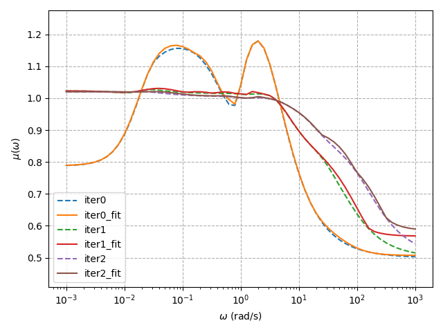
.. image:: _static/example_3/3_plot_D.png

D-K iteration with interactively selected fit orders
----------------------------------------------------

In this example, the user is prompted to select a D-scale fit order at each
iteration. The user is shown the frequency-by-frequency and fit structured
singular value plots at each iteration.

.. literalinclude:: ../examples/4_example_dk_iter_interactive.py
  :language: python

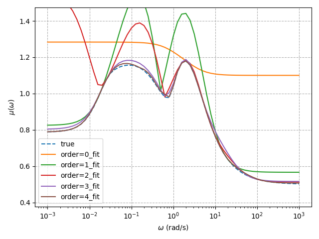

Prompt::

    Close plot to continue...
    Select order (<Enter> to end iteration): 4

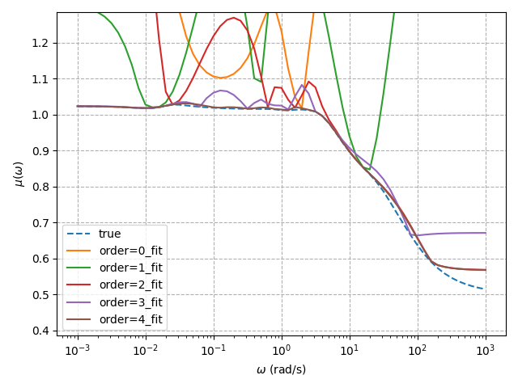

Prompt::

    Close plot to continue...
    Select order (<Enter> to end iteration): 4

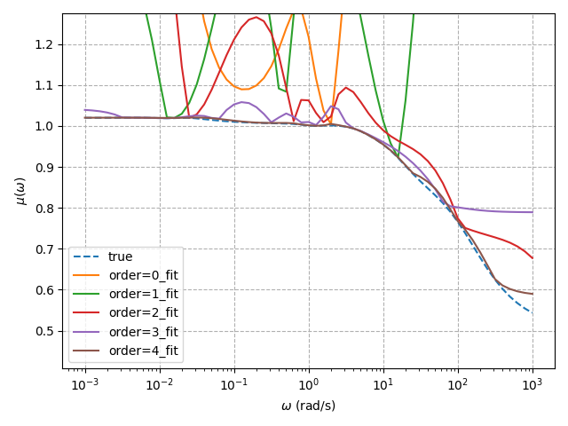

Prompt::

    Close plot to continue...
    Select order (<Enter> to end iteration): 4

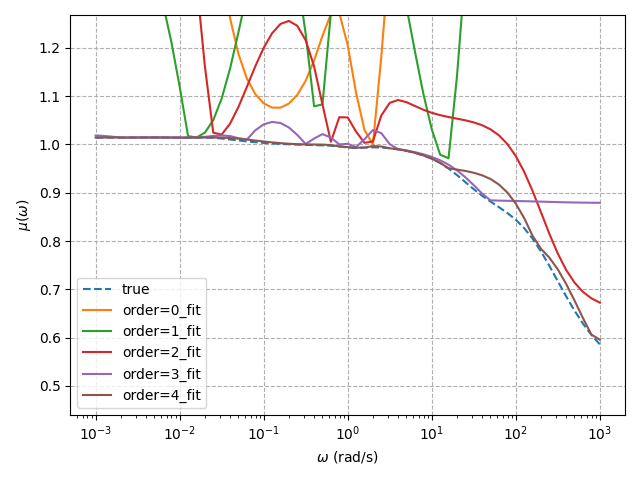

Output::

    Close plot to continue...
    Select order (<Enter> to end iteration): 
    Iteration ended.
    mu=1.0144329071044922

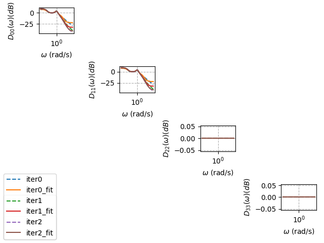

D-K iteration with a custom fit order selection method
------------------------------------------------------

In this example, a custom D-K iteration class is used to stop the iteration
after 3 iterations of 4th order fits.

.. literalinclude:: ../examples/5_example_dk_iteration_custom.py
  :language: python

Output::

    Iteration 0 with mu of 1.1792182922363281
    Iteration 1 with mu of 1.0274028778076172
    Iteration 2 with mu of 1.0203123092651367
    Iteration 3 with mu of 1.0144329071044922
    mu=1.0144329071044922

.. image:: _static/example_5/5_plot_mu.png

D-K iteration for non-square perturbation and simulation of perturbed systems 
-----------------------------------------------------------------------------

In this example, the perturbation `Δ` is non-square. In other words, the inputs
and outputs of the perturbation are not identical. The orders are specified in
a list. Once the robust controller is synthesized, it is tested on a set of
perturbed systems by generating a set of perturbations `Δ` that have H-infinity
norm less than or equal to 1.

In this example, a controller is designed for the linearized lateral dynamics
of an aircraft from an example given in Section 14.1 of [M04]_.

.. literalinclude:: ../examples/6_dk_iteration_non_square_perturbation.py
   :language: python

Output::

    mu: 0.9824275970458984

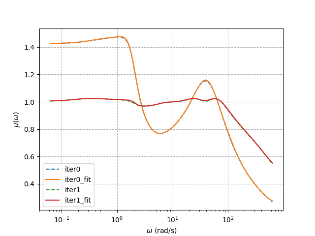

After the controller is synthesized, a set of off-nominal models are generated
by interconnecting various admissible perturbations `Δ` with the nominal model.
Then, the closed-loop systems are formed for each perturbed system. The time
domain response of the systems can be obtained for a step response in the roll
angle reference signal, no external disturbances, and moderate sensor noise. In
particular, the response of the system states and actuator inputs are shown.

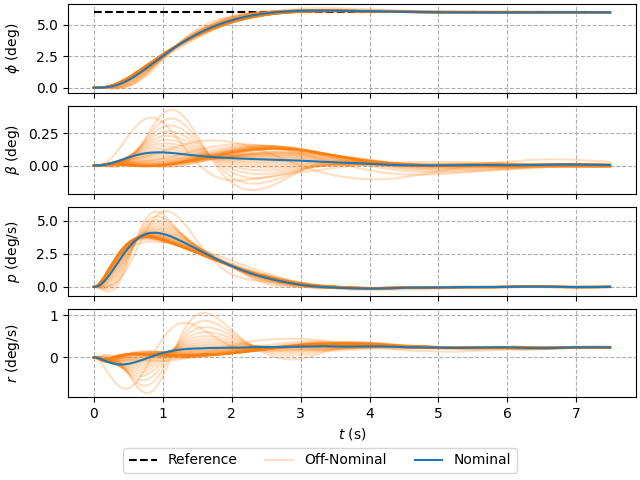

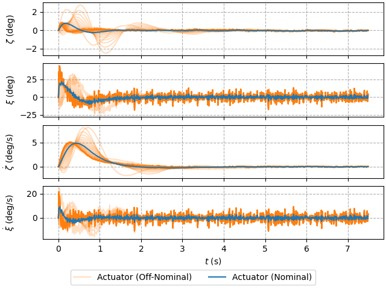

Multi-Model Uncertainty Characterization: Academic Model
--------------------------------------------------------

In this example, an unstructured uncertainty set is characterized from a set of
nominal and off-nominal frequency responses. This is an academic example as the
uncertain model in this problem is arbitrarily selected for the purpose of
demonstration. The off-nominal models are generated from a nominal model by
randomly perturbing the parameters within a known bound.

.. literalinclude:: ../examples/7_uncertainty_characterization.py
   :language: python

`dkpy` provides plotting functionality for the nominal and off-nominal systems.
The frequency response of the magnitude, phase, and singular values are
as follows. These plots show the variation in the frequency response caused
by the variation in parameters.

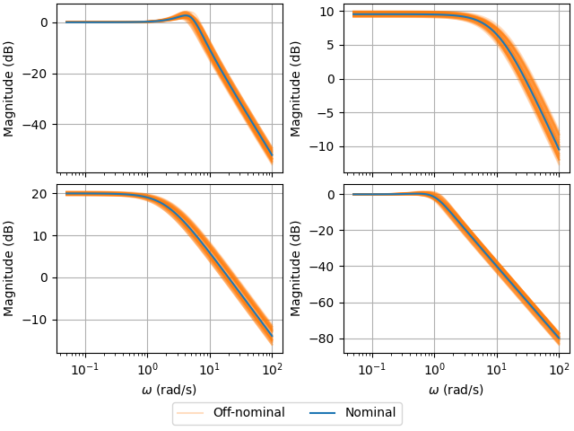

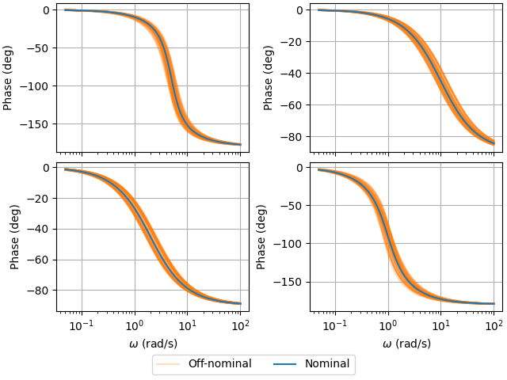

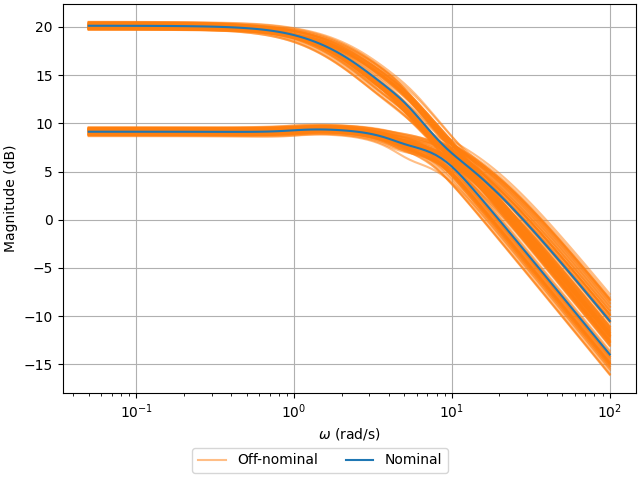

Next, the uncertainty residual can be computed for each off-nominal system and
uncertainty model. `dkpy` implements six unstructured uncertainty models:

* Additive uncertainty ("A");
    .. image:: _static/example_7/7_sval_residual_A.png
* Multiplicative input uncertainty ("I");
    .. image:: _static/example_7/7_sval_residual_I.png
* Multiplicative output uncertainty ("O");
    .. image:: _static/example_7/7_sval_residual_O.png
* Inverse additive uncertainty ("iA");
    .. image:: _static/example_7/7_sval_residual_iA.png
* Inverse multiplicative input uncertainty ("iI");
    .. image:: _static/example_7/7_sval_residual_iI.png
* Inverse multiplicative output uncertainty ("iO").
    .. image:: _static/example_7/7_sval_residual_iO.png

See Chapter 8.2.3 of [SP06]_ for more information on these unstructured 
uncertainty models. The maximum singular value responses of all uncertainty
models are shown here.

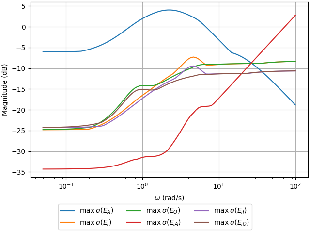

As a rule of thumb, the uncertainty model that is selected should have the
smallest maximum singular value over the control bandwidth and high uncertainty
at large frequencies to account for unmodeled dynamics. In this case, the 
inverse additive uncertainty ("iA") model seems to be the best option, which will be 
used moving forward.

The uncertainty set is parametrized as `E = WL Δ WR`. `E` is the uncertainty
residual, `Δ` is the normalized perturbation, and `WL`, `WR` are the dynamic
weights used to parametrize the uncertainty set. The frequency response of the
optimal weights with minimal magnitude at each frequency can be solved for from
the uncertainty residuals for different assumptions on their structure. It is
assumed that both weights are diagonal moving forward. Then, an overbounding 
stable and minimum phase linear time-invariant (LTI) system can be fit to the 
frequency response of the weights to obtain a LTI description of the uncertainty
set. The optimal weight frequency responses and fitted weights are shown below.

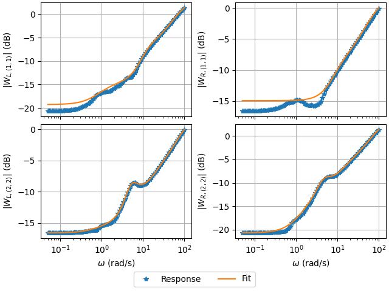

Multi-Model Uncertainty Characterization: Aircraft Actuator Model
-----------------------------------------------------------------

In this example, an unstructured uncertainty set is characterized from a set of
nominal and off-nominal frequency responses. In this example, the uncertainty
of an aircraft actuator model is characterized using an actuator model from an
example given in Section 14.1 of [M04]_. 

.. literalinclude:: ../examples/8_aircraft_actuator_uncertainty_characterization.py
   :language: python

The off-nominal frequency response data is generated by sampling valid
perturbations from the uncertainty model provided in the problem statement.

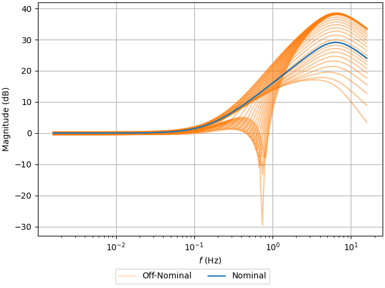

Three different candidate uncertainty models are evaluated: additive
uncertainty, multiplicative input uncertainty, and inverse multiplicative
input uncertainty. The multiplicative input uncertainty is selected as it
yields the smallest residual singular values.

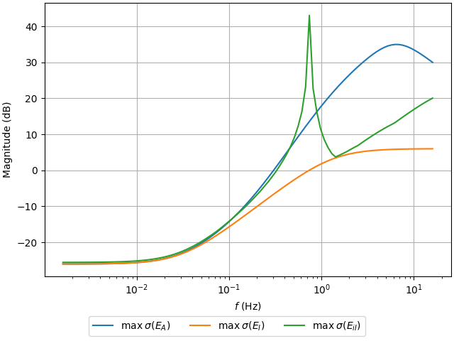

The left uncertainty weight is constrained to be scalar whereas the right uncertainty
weight is constrained to the identity matrix. Given that the right uncertainty
weight is the identity matrix, a fit does not need to be performed for this weight
as it will be neglected in the generalized plant.

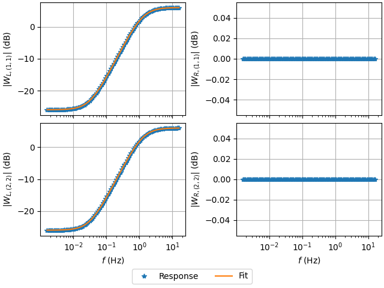

